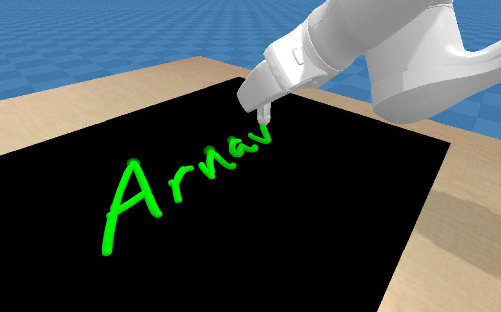

# Manipulation Engine - Calligraphy

## Install with a virtualenv
```bash
python3 -m pip install --user virtualenv
python3 -m venv env
source env/bin/activate
pip3 install --upgrade pip
git clone https://github.com/gabearod2/calligraphy.git
cd calligraphy
pip3 install -e .
pip install opencv-python
pip install scikit-image
```

## Writing 
```bash
python3 write.py
```

## Evaluate
```bash
python3 evaluate.py
```
## Print Results
```bash
cd results
python3 print_results.py
```

